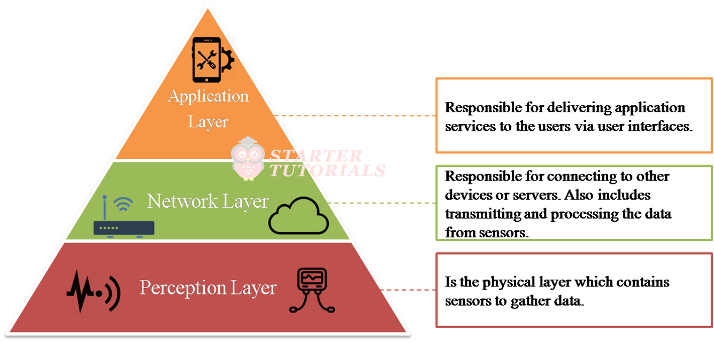
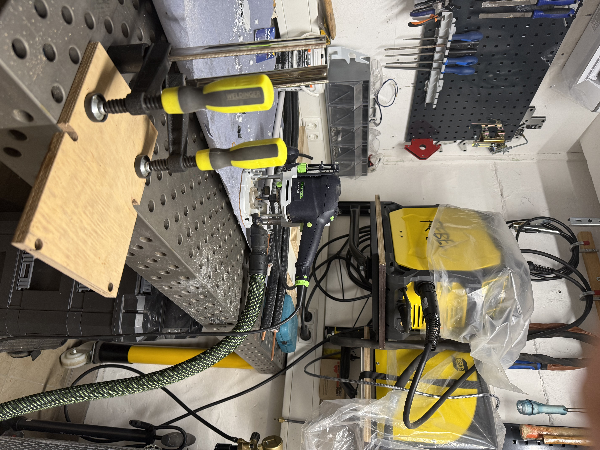

# OASIS: Optimized Aqua Soil Irrigation System

**Michał Roziel · Hanan Ahmed Ashir · Laith Arafeh · Omar Qoul**
HTW Saar — Saarbrücken, 04.02.2026

---

# Introduction

## Motivation

Manual plant irrigation is often inefficient and inconsistent in practice. Irregular watering intervals or incorrectly estimated water quantities can lead to either resource wastage or an undersupply of water to the plants.

Furthermore, rainwater frequently remains unutilized, as manual extraction and distribution from water containers is a labor-intensive work. From a computer science perspective, this problem presents an ideal application for an IoT control system designed to eliminate these inefficiencies through automation and data-driven decision-making.

## Project Description and Goals

The project *OASIS* consists of an ESP32-based sensor and a Raspberry-Pi acting as a central control unit. The primary objective of this project is to implement and test a cost-effective automation system. The focus lies on maximizing the utilization of rainwater.

The system is designed to ensure the following functionalities:

- **Sensor Technology:** Deployment of two sensors to capture the system state. This includes measuring soil moisture as well as monitoring water levels.

- **Weather API:** Utilization of an open-source web API to verify recent rain levels. This ensures that watering is disabled if rainfall has occured within the past few hours, thereby preventing over-watering.

- **Automated Control:** The system autonomously regulates plant irrigation based on sensor data.

- **Overflow Management:** The system monitors the water level in the collection tank to detect and regulate potential overflows.

The data collected by the sensors and the ESP32 is stored locally on an InfluxDB, which can then be connected to a Grafana Dashboard, that visualizes the data.

## Scope

The current scope of this project is limited to demonstrating the complete system logic using a miniaturized model. This model serves as a proof of concept, intended to validate the fundamental control logic and the technical architecture. The successful operation of this model forms the basis for scaling the system to a real-world garden.

# System Design

To structure the system in a clear and scalable way, the project follows the 3-Layer IoT architecture model, consisting of a Perception, Network and Application Layer.

<figure data-latex-placement="h">

<figcaption>IOT-Layers</figcaption>
</figure>

This model is wildly used in IoT Systems because it seperates responsibilities, reduces system complexity and decision making logic can be clearly seperated.

## Perception Layer

### Components

- **Soil moisture sensor:** measures the moisture level in the soil

- **ESP32:** reads the sensor values and converts them into usuable percentage

- **Pump und relay**: Executes the watering action based on control commands

### Responsibilities

- Capture environmental data

- Perform low level processing

- Execute actuator commands

## Network Layer

### Components

- **WiFi-Connection:** Sets the connection between the ESP32 and the Internet

- **MQTT Protocol and HiveMQ Broker:** routes messages between publisher(ESP32) and subscriber/publisher(Raspberry Pi)

### Responsibilities

- Reliable message and data transport using MQTT topics

- Enables publish and subscribe communication

## Application Layer

### Components

- **Raspberry-Pi:** runs the control logic

- **InfluxDB:** stores sensor measurements

- **WeatherAPI:** provides weather data

### Responsibilities

- Persist sensor data in database

- Retrieve weather data and combine it with sensor readings. Decide if irrigation is allowed

- Publish PUMP ON/OFF commands back to the esp

# Technical Description of the Project

## System Architecture

This subsection outlines the hardware and the software components used in the perception and application layer.

## Hardware Setup

## Software Structure

## Communication and Data Flow

# Build and Setup Guide

## Bill of Materials

| **Name** | **Usage** | **Quantity** | **Acquired By** | **Cost** |
|:---|:---|:--:|:---|:--:|
| Large Project Enclosure | Project Case | 1 | Michał | 15 |
| Small Project Enclosure | Project Case | 1 | Michał | 10 |
| 11L water tank | Water saving tank | 1 | Michał | 19 |
| 3L water tank | Simulation of rainwater | 1 | Michał | 10 |
| Phoenix contact terminal blocks | Safe Distribution of DC Voltages | 6 | Michał | Pre-Owned |
| mounting rails | mounting of terminal blocks | 1 | Michał | Pre-Owned |
| mounting screws | mounting of sensors & base plates | 20 | Michał | Pre-Owned |
| Water valve | actuating the rainwater | 1 | Michał | 3 |
| ESP32 Breadboard Kit | Bits and Pieces | 1 | Michał | 23 |
| DC jack connectors | Power supply to the project | 1 | Michał | 8 |
| Custom wooden base plate | mounting base for sensors & rails | 2 | Michał | Created |
| TL231 | 24V DC water pressure sensor | 1 | EmRoLab | Given |
| HW-685 | 5V DC Voltage-Amperage Converter | 1 | EmRoLab | Given |
| Capacitive moisture sensor v1.2 | Soil moisture monitoring | 1 | EmRoLab | Given |
| 12V DC water Pump | pumping water from water tank to plants | 1 | EmRoLab | Given |
| 12V DC Solenoid Valve | 3-Way diverter to either tank or drain | 1 | Michał | 15 |
| 230V Relay | Used to relay Voltage to Pump and Solenoid Valve | 2 | EmRoLab | Given |
| 5V DC Power Supply | Supply Power to Esp and Relays | 1 | Michał | Pre-Owned |
| 12V DC Power Supply | Supply Power to Pump and Solenoid Valve | 1 | EmRoLab | Given |
| 24V DC Power Supply | Supply Power to TL231 | 1 | EmRoLab | Given |

Bill of Materials

 

## Wiring and Assembly

## Firmware Upload

## Commissioning / Initial Startup

## Troubleshooting

# Work Distribution (Group Work)

## Roles and Responsibilities

| Team Member | Responsibilities | Tools | Effort |
|:---|:---|:---|:--:|
| Hanan | Software Implementation and Documentation | Raspberry Pi, Grafana, InfluxDB, LaTeX |  |
| Michał | Hardware and Software Implementation, Documentation | Power Tools, Sensors, Electrical circuits, LaTeX |  |
| Laith | Software Implementation | Raspberry Pi and Python Scripts |  |
| Omar | Software Implementation | Raspberry Pi and Python Scripts |  |

Task Distribution und Effort

## Individual Contributions

Here, each team members individual contributions are presented. The respective contribution reflects their share of the total workload.

### Omar Qoul

### Laith Arafeh

### Hanan Ahmed Ashir

Responsible for the Software implementation of the project. This included dividing the work among all the team members. I also set up and configured InfluxDB on the raspberry Pi, including managing the sensor data, integrating Grafana for the visualization of time-series data, and incorporating the WeatherAPI to enable the watering decisions.

### Michał Roziel

Picked up the hardware components which the *EmRoLab* team provided us with. Bought and provided additional hardware components listed in the bill of materials.  
Created custom wooden base plates for both hardware enclosures by using power as well as precision (woodworking) tools.  
Drilled holes into both project enclosures to fit previously mentioned base plates and self soldered DC-Jack connectors. Connected all of the wiring found in the project.  

Tested, connected, assembled and installed all of the hardware used in the project.  
Sensor testing was done by using a high fidelity Fluke multimeter.  
Set up a GitHub repository <https://github.com/michalroziel/oasis> for collaboration purposes and developed code to test out the functionality of all sensors used in the project. Contributed to the establishing of communication between the ESP32 and Raspberry Pi via MQTT.  
Created In-depth project schematic showcasing internal logic and electrical connections.  
Contributed to all project presentations throughout the course. Contributed to collaborative project documentation using LaTeX.

# Outlook and Lessons Learned

## Future Improvements

As a future improvement, the system could be deployed on a remote server instead of running exclusively on a local Raspberry Pi. This would enable remote access to sensor data and system status, increase scalability and allow the project to be maintained as an open source solution. By publishing the data other users and developers could reuse and extend the system for their own applications.

Additional improvements could include the integration of further environmental sensors and use of weather forecasts in addition to the historical rainfall data to further optimize irrigation decisions.

## Lessons Learned

- During the development of the system, the team gained practical experience in handling different DC voltage levels (5V, 12V and 24V). To ensure safe and reliable connections, Phoenix Contact terminal blocks were used. Working with these components and wiring the OASIS System provided a fundamental understanding of basic engineering principles, such as voltage separation, grounding and safe power distribution.

- Furthermore, implementing communication between the ESP32 and the raspberry Pi using the MQTT publish/subscribe model significantly improved the teams understanding of system architecture.

- A practical limitation that we encountered during the project was related to the network accessibility. Since Grafana and InfluxDB were configured to run on the raspberryPi using localhost bindings, access to the dashboard was only possible within the local network. As a result, connections via public or university WiFi networks were not feasible without additional configuration, for which we had little to no time.

# References / Sources

Here, the reader is presented with the sources that allowed our team to collect the knowledge needed to complete each task at hand.

## Images

Here, the reader is shown pictures of OASIS during its development process.

<figure data-latex-placement="p">
<figure>

<figcaption>start of assembly</figcaption>
</figure>
<figure>

<figcaption>wooden enclosure baseplate</figcaption>
</figure>
<figure>

<figcaption>in the workshop</figcaption>
</figure>
<figure>

<figcaption>Phoenix Contact terminals blocks</figcaption>
</figure>
<figure>

<figcaption>first wiring using soldered DC connectors</figcaption>
</figure>
<figcaption>Initial development phase</figcaption>
</figure>

## Quotes / Citations

- **Turais Tech Docs**, *Turais TL231 technical documentation*. Available at: <https://docs.turais.de/docs/sensors/misc/tl231-water-level-sensor/>  
  (Accessed: 2026-02-18).

- **Turais Tech Docs**, *Turais HW-685 technical documentation*. Available at: <https://docs.turais.de/de/docs/modules/hw685/>  
  (Accessed: 2026-02-18).

- **Polulu Docs**, *Polulu MAX14870 technical documentation*. Available at: <https://www.pololu.com/product/2961>  
  (Accessed: 2026-02-18).

- **Circuit State Docs**, *Curcuit State ESP32 technical documentation*. Available at: <https://www.circuitstate.com/pinouts/doit-esp32-devkit-v1-wifi-development-board-pinout-diagram-and-reference/>  
  (Accessed: 2026-02-18).

- **How to Mechatronics** , *YouTube tutorial on Controlling a DC Motor using H-Bridge*. Available at: <https://www.youtube.com/watch?v=I7IFsQ4tQU8>  
  (Accessed: 2026-02-18).

## AI Tools Used

Generative AI was used to help generate LaTeX code for figures to incorporate project pictures on a single page.

## Other Resources
