

<embed src="./assets/graphics/htw_logo.pdf" />

**OASIS: Optimized Aqua Soil Irrigation System**

By  
Michał Roziel, 5012845  
Hanan Ahmed Ashir, 5012967  
Laith Arafeh, 5024761  
Omar Qoul, 5024765

Saarbrücken, 04.02.2026

# Introduction

## Motivation

Manual plant irrigation is often inefficient and inconsistent in
practice. Irregular watering intervals or incorrectly estimated water
quantities can lead to either resource wastage or an undersupply of
water to the plants.

Furthermore, rainwater frequently remains unutilized, as manual
extraction and distribution from water containers is a labor-intensive
work. From a computer science perspective, this problem presents an
ideal application for an IoT control system designed to eliminate these
inefficiencies through automation and data-driven decision-making.

## Project Description and Goals

The project *OASIS* consists of an ESP32-based sensor and a Raspberry-Pi
acting as a central control unit. The primary objective of this project
is to implement and test a cost-effective automation system. The focus
lies on maximizing the utilization of rainwater.

The system is designed to ensure the following functionalities:

- **Sensor Technology:** Deployment of two sensors to capture the system
  state. This includes measuring soil moisture as well as monitoring
  water levels.

- **Weather API:** Utilization of an open-source web API to verify
  recent rain levels. This ensures that watering is disabled if rainfall
  has occured within the past few hours, thereby preventing
  over-watering.

- **Automated Control:** The system autonomously regulates plant
  irrigation based on sensor data.

- **Overflow Management:** The system monitors the water level in the
  collection tank to detect and regulate potential overflows.

The data collected by the sensors and the ESP32 is stored locally on an
InfluxDB, which can then be connected to a Grafana Dashboard, that
visualizes the data.

## Scope

The current scope of this project is limited to demonstrating the
complete system logic using a miniaturized model. This model serves as a
proof of concept, intended to validate the fundamental control logic and
the technical architecture. The successful operation of this model forms
the basis for scaling the system to a real-world garden.

# System Architecture and Technical Description

To describe the structure of the OASIS System, a module based system
architecture is used. This approach focuses on concrete hardware and
software components and the communication between them. As a result, the
actual system behavior and data flow are easier to understand and
directly reflect the implemented solution.

<figure id="fig:placeholder" data-latex-placement="H">
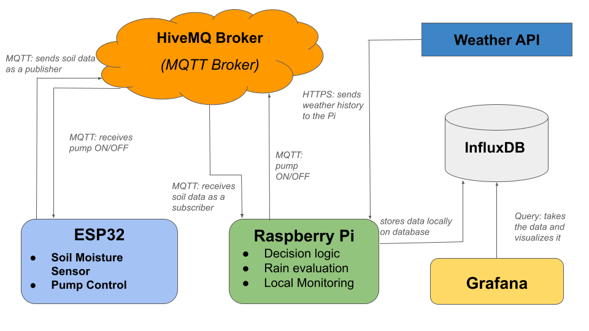
<figcaption>Architecture of OASIS</figcaption>
</figure>

## Hardware Setup

The hardware setup of the OASIS system consists of an ESP32 and a
Raspberry Pi acting as the central control unit. The ESP32 is connected
to a soil moisture sensor, which continuously measures the moisture
level of the soil. The raw sensor values are processed locally on the
ESP32 and converted into percentage based moisture readings.

In addition to sensing, the ESP32 controls a water pressure sensor and a
water pump. Since the water pump operates at 12V and the water pressure
sensor at 24V, a relay and a amperage to voltage converter is used to
isolate the microcontroller from the high voltage circuit and to safely
switch the pump, since the ESP32 can only handle voltages up to 5V. This
allows the system to physically execute irrigation actions based on
received control commands. For monitoring and debugging purposes, the
ESP32 outputs sensor readings to the serial monitor in real time.

<figure id="fig:hardware-setup" data-latex-placement="H">
<figure>
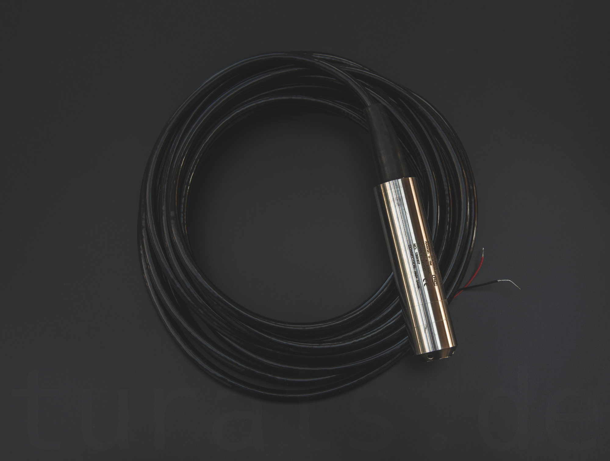
<figcaption>Water level Sensor</figcaption>
</figure>
<figure>
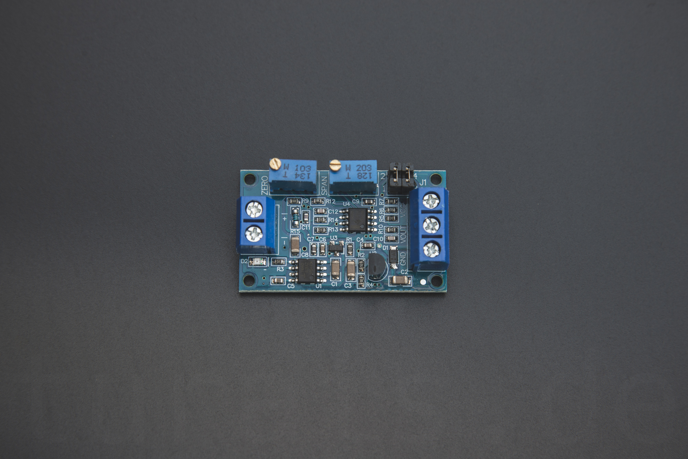
<figcaption>HW-685 Amperage to Voltage converter</figcaption>
</figure>
<figcaption>Components used during hardware assembly</figcaption>
</figure>

The Raspberry Pi hosts the software components responsible for data
processing, storage, and visualization. All hardware components are
powered by using appropriate DC voltage levels, and special care and
professional advice was taken to ensure electrical separation and safe
wiring between the circuits.

<figure id="fig:placeholder" data-latex-placement="H">
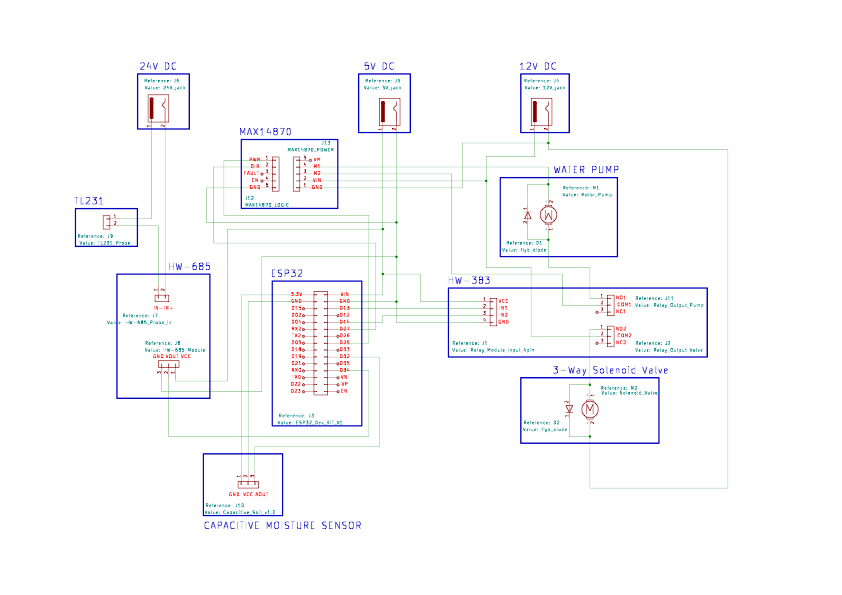
<figcaption>Schematics of the hardware</figcaption>
</figure>

## Software Structure

The software architecture of OASIS is divided into distributed
components running on the ESP32 and the Raspberry Pi.

The ESP32 firmware is responsible for reading the sensor data,
performing the basic preprocessing and publishing the measurements to
the MQTT Broker. It also subscribes to the control topics to receive
irrigation commands and actuates the pump accordingly.

The Raspberry Pi runs multiple software services. A Python based control
application subscribes to MQTT topics to receive soil moisture data and
acts as the central decision logic of the system. Incoming sensor data
is stored in InfluxDB, a local time-series database optimized for sensor
measurements.

For visualization purposes, Grafana is used to query InfluxDB and
display soil moisture data and system behavior in interactive
dashboards. In addition, the Raspberry Pi integrates the WeatherAPI to
retrieve historical rainfall data, which is used to make even better
decisions.

<figure id="fig:placeholder" data-latex-placement="H">
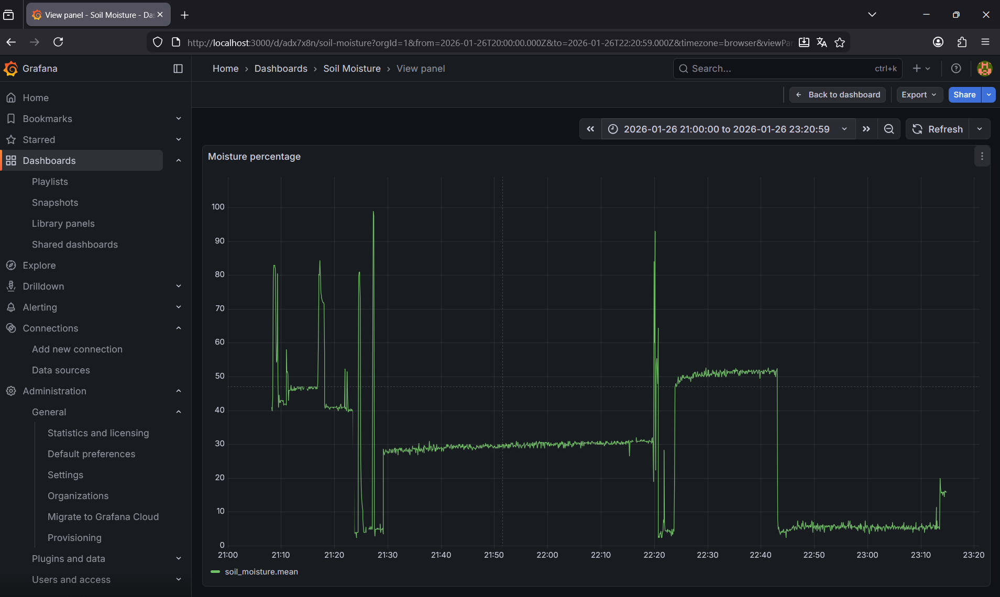
<figcaption>Visualization of Soil Measurements using
Grafana</figcaption>
</figure>

<figure id="fig:placeholder" data-latex-placement="H">
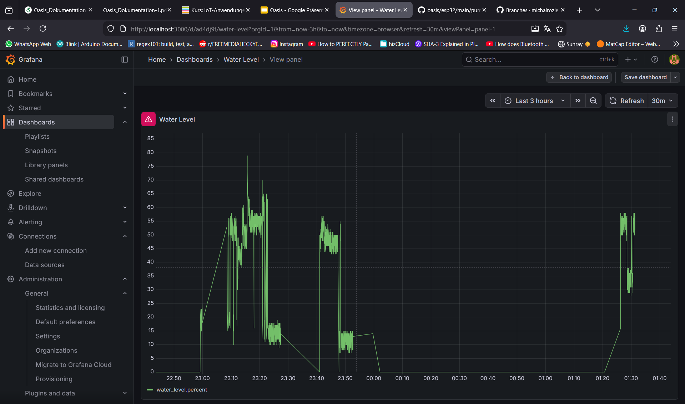
<figcaption>Visualization of Water Tank Level using Grafana</figcaption>
</figure>

## Communication and Data Flow

Communication between the system components is realized using a
combination of MQTT and HTTPS interfaces. The ESP32 publishes soil
moisture measurements to predefined MQTT topics via a public HiveMQ
broker. The Raspberry Pi subscribes to these topics and receives data
asynchronously.

After receiving the data, the raspberry Pi stores the measurements in
InfluxDB and retrieves the historical rainfall information from the
WeatherAPI using HTTPS requests. Based on the combination of soil
moisture and recent rainfall data, the control logic decides whether
irrigation is permitted or not.

If watering is allowed, the Raspberry Pi publishes a corresponding
control command to the MQTT broker. The ESP32, which subscribes to this
control topic, receives the command and activates or deactivates the
water pump accordingly.

InfluxDB acts as a passive data storage component and does not actively
send data to any modules. Grafana queries InfluxDB at configurable
intervals to retrieve the saved data for visualization. This pull-based
approach ensures a clear separation between data storage, processing and
visualization.

# Build and Setup Guide

## Bill of Materials

| **Name** | **Usage** | **Quantity** | **Acquired By** | **Cost(€)** |
|:---|:---|:--:|:---|:--:|
| Large Project Enclosure | Project Case | 1 | Michał | 15 |
| Small Project Enclosure | Project Case | 1 | Michał | 10 |
| 11L water tank | Water saving tank | 1 | Michał | 19 |
| 3L water tank | Simulation of rainwater | 1 | Michał | 10 |
| Phoenix contact terminal blocks | Safe Distribution of DC Voltages | 6 | Michał | Pre-Owned |
| mounting rails | mounting of terminal blocks | 1 | Michał | Pre-Owned |
| mounting screws | mounting of sensors & base plates | 20 | Michał | Pre-Owned |
| Water valve | actuating the rainwater | 1 | Michał | 3 |
| ESP32 Breadboard Kit | Bits and Pieces | 1 | Michał | 23 |
| DC jack connectors | Power supply to the project | 1 | Michał | 8 |
| Custom wooden base plate | mounting base for sensors & rails | 2 | Michał | Created |
| TL231 | 24V DC water pressure sensor | 1 | EmRoLab | Given |
| HW-685 | 5V DC Voltage-Amperage Converter | 1 | EmRoLab | Given |
| Capacitive moisture sensor v1.2 | Soil moisture monitoring | 1 | EmRoLab | Given |
| 12V DC water Pump | pumping water from water tank to plants | 1 | EmRoLab | Given |
| 12V DC Solenoid Valve | 3-Way diverter to either tank or drain | 1 | Michał | 15 |
| 230V Relay | Used to relay Voltage to Pump and Solenoid Valve | 2 | EmRoLab | Given |
| 5V DC Power Supply | Supply Power to Esp and Relays | 1 | Michał | Pre-Owned |
| 12V DC Power Supply | Supply Power to Pump and Solenoid Valve | 1 | EmRoLab | Given |
| 24V DC Power Supply | Supply Power to TL231 | 1 | EmRoLab | Given |

Bill of Materials

## Wiring and Assembly

The wiring and assembly of the OASIS System were carried out in a
modular and safe manner. Due to the use of multiple DC voltage levels
(5V , 12V, 24V), Phoenix contact terminal blocks were employed to ensure
a clear separation of power domains and reliable distribution of supply
voltages.

All components were mounted inside custom wooden base plates. The ESP32
and low-voltage controls were provided with 5V of power, while the water
pump and the valve operated at 12V. The pressure sensor required a
separate 24V supply. Relays were used to isolate the low-voltage control
logic from the higher voltage loads.

Special Care was also taken to route signal wires and power cables
separately to reduce interference. All connections were tested for
correct polarity and secure mounting before powering the system.

## Firmware Upload

The ESP32 firmware was developed using the Arduino IDE. Prior to
uploading the firmware, the ESP32 was connected to a host computer via
USB. The correct board type and serial port were selected in the
development environment.

Configuration parameters such as WiFi credentials and MQTT information
were defined before flashing the firmware. After uploading, the serial
monitor was used continuously to verify the connection to the network
and the publication of the data.

## Initial Startup and Commissioning

During initial startup, the system was powered on step by step to ensure
the correct operation of all components. First, the Raspberry Pi and
database services wer started and verified. Next the ESP32 was powered
and observed via the serial monitor.

Sensor readings were checked for plausibility and relay switching was
done and tested by Michał to verify correct pump and valve control. Once
all components behaved as expected, the water system was activated and
the full irrigation system workflow was tested under controlled
conditions.

## Troubleshooting

Several challenges were encountered during development and testing.
Network connectivity issues occasionally occurred due to incorrect WiFi
credentials and restricted networks.

Incorrect sensor readings were addressed by recalibrating the soil
moisture sensor and checking the wired connections. Actuators, relays
and power supply voltages were checked over and over again during the
development process.

# Work Distribution (Group Work)

## Roles and Responsibilities

All software components of the project were developed by using the
Git-Repostory made by *Michał*: <https://github.com/michalroziel/oasis>.
The repository was used to manage source code, config files and
documentation throughout the development process.

Each contributor worked on dedicated features and components and had his
own responsibilities and tools, which can be seen in the table below:

| **Team Member** | **Responsibilities** | **Tools** | **Effort** |
|:---|:---|:---|:--:|
| Hanan | Software Implementation and Documentation | Raspberry Pi, Grafana, InfluxDB, Latex | 65 |
| Michał | Hardware and Software Implementation, Documentation | Power Tools, Sensors, Electrical circuits, Latex | 110 |
| Laith | Software Implementation | Raspberry Pi and Python Scripts | 65 |
| Omar | Software Implementation | Raspberry Pi and Python Scripts | 65 |

Task Distribution und Effort

## Individual Contributions

Here, each team members individual contributions are presented. The
respective contributions reflect their share of the total workload.

### Omar Qoul

Contributed to the development of the ESP32 firmware, including the
implementation and calibration of sensor readings. Additionally, I
assisted with the configuration of InfluxDB and contributed to the
implementation of the WeatherAPI, which supported decision-making
related to irrigation control. Played a vital role in the testing of
MQTT connections and was responsible for the presentations alongside
Laith.

### Laith Arafeh

Calibrated the soil-moisture sensor and tested the water level sensor
used to monitor the rainwater tank. Helped in writing the Firmware for
the ESP32 that reads, converts, and transmits the sensor values from the
ESP32 to the MQTT broker. Set up the MQTT infrastructure and configured
the HiveMQ broker and is responsible for the presentations alongside
Omar.

### Hanan Ahmed Ashir

Responsible for the Software implementation of the project. Installed
and configured InfluxDB and Grafana on the raspberry Pi, managed sensor
data, integrated Grafana for time-series visualization, and incorporated
the WeatherAPI to enable more logical decisions alongside Omar and
Laith. In addition, responsible for authoring the complete project
documentation and coordinating the distribution of tasks among the team
members.

### Michał Roziel

Picked up the hardware components which the *EmRoLab* team provided us
with. Bought and provided additional hardware components listed in the
bill of materials. Created custom wooden base plates for both hardware
enclosures by using power as well as precision (woodworking) tools.
Drilled holes into both project enclosures to fit previously mentioned
base plates and self soldered DC-Jack connectors. Connected all of the
wiring found in the project. Tested, connected, assembled and installed
all of the hardware used in the project. Sensor testing was done by
using a high fidelity Fluke multimeter. Contributed to the establishing
of communication between the ESP32 and Raspberry Pi via MQTT.

Created In-depth project schematic showcasing internal logic and
electrical connections.  
Contributed to all project presentations throughout the course.
Contributed to collaborative project documentation using LaTeX.

# Outlook and Lessons Learned

## Future Improvements

As a future improvement, the system could be deployed on a remote server
instead of running exclusively on a local Raspberry Pi. This would
enable remote access to sensor data and system status, increase
scalability and allow the project to be maintained as an open source
solution. By publishing the data other users and developers could reuse
and extend the system for their own applications.

Additional improvements could include the integration of further
environmental sensors and use of weather forecasts in addition to the
historical rainfall data to further optimize irrigation decisions.

## Lessons Learned

- A major challange during hardware assembly was the integration of
  components operating at different voltage levels. The water sensor
  required 24V, while the ESP32 is limited to 5V. To ensure safe
  operation, relays, Phoenix Contact Terminal blocks and different
  amperage to voltage converters were used to isolate the high voltage
  circuit. Overcoming this challenge improved the team’s understanding
  of mixed voltage system design.

- Furthermore, implementing communication between the ESP32 and the
  raspberry Pi using the MQTT publish/subscribe model significantly
  improved the teams understanding of system architecture.

- A practical limitation that we encountered during the project was
  related to the network accessibility. Since Grafana and InfluxDB were
  configured to run on the raspberryPi using localhost bindings, access
  to the dashboard was only possible within the local network. As a
  result, connections via public or university WiFi networks were not
  feasible without additional configuration, for which we had little to
  no time.

- Another problem encountered was the sensitivity of the water level
  sensor provided to us*Figure 2(a)*. Since the sensor is designed to
  handle huge tanks, the smaller tank that we had handled severe
  fluctuations, hereby preventing us from getting any stable
  readings*(Figure 5)*. To solve this, we hard coded the diverter to
  move the water around based on the Raspberry Pi’s decisions.

# References

This section provides an overview of the references and supporting
materials used throughout the development of the project. During the
implementation, various external sources were consulted to ensure
correct technical decisions and proper system design. In addition,
images were taken during the development process to support the
explanation of the system.

## Images

<h3>Hardware Assembly Process</h3>
<table>
  <tr>
    <td width="50%">
      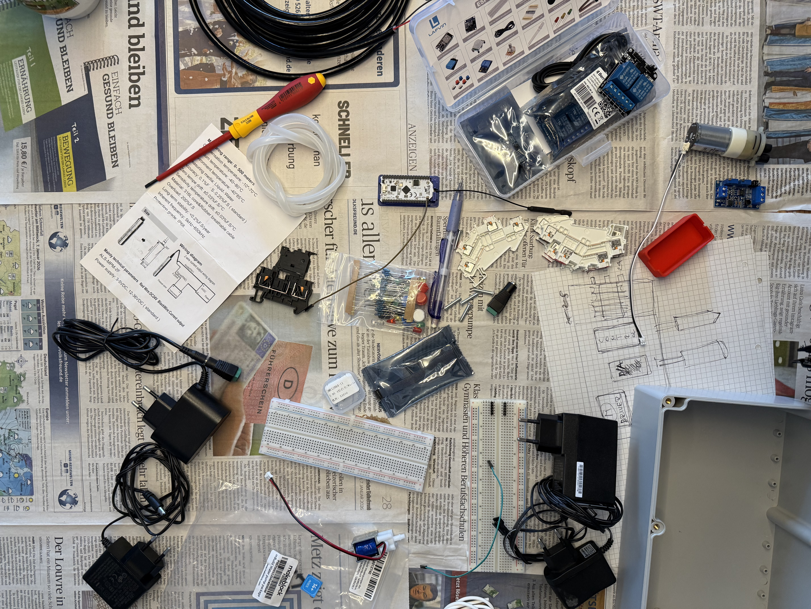
       
      <b>Start of assembly</b>
    </td>
    <td width="50%">
      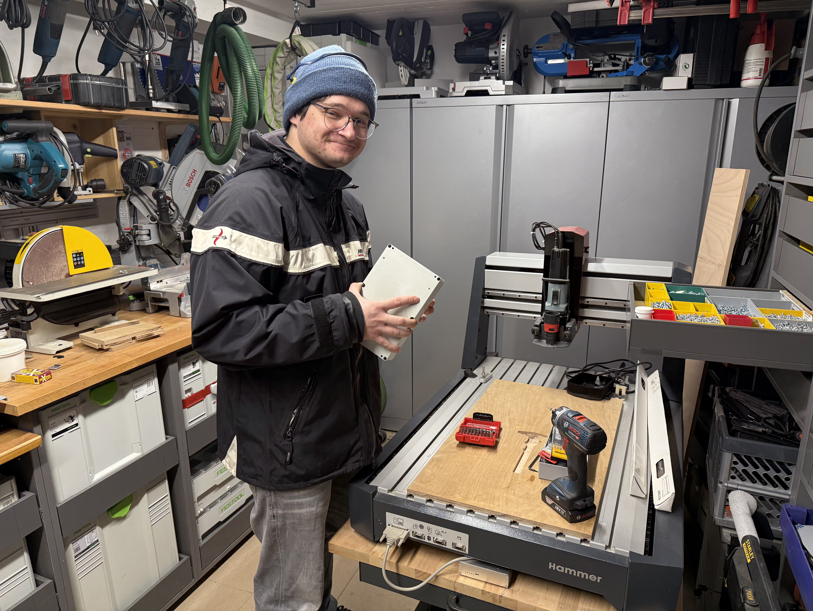
       
      <b>In the workshop</b>
    </td>
  </tr>
  <tr>
    <td>
      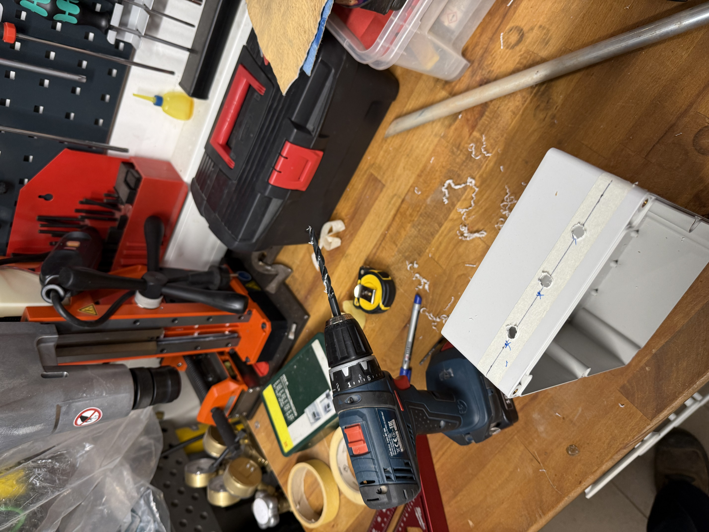
       
      <b>Drilling holes into enclosure</b>
    </td>
    <td>
      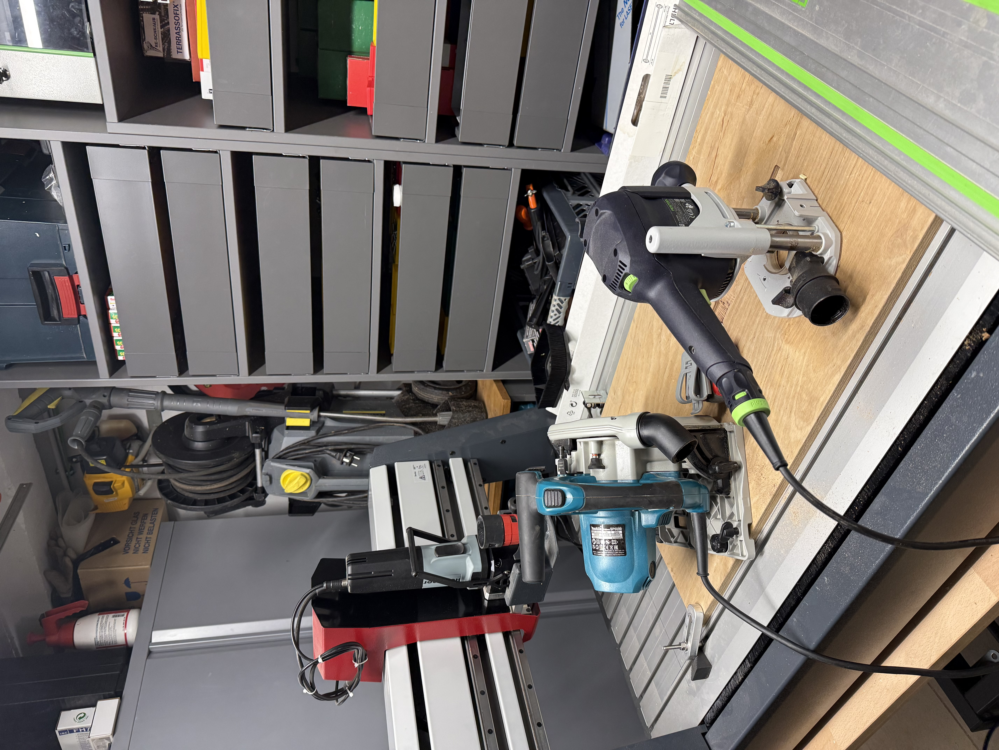
       
      <b>Wooden enclosure baseplate</b>
    </td>
  </tr>
  <tr>
    <td>
      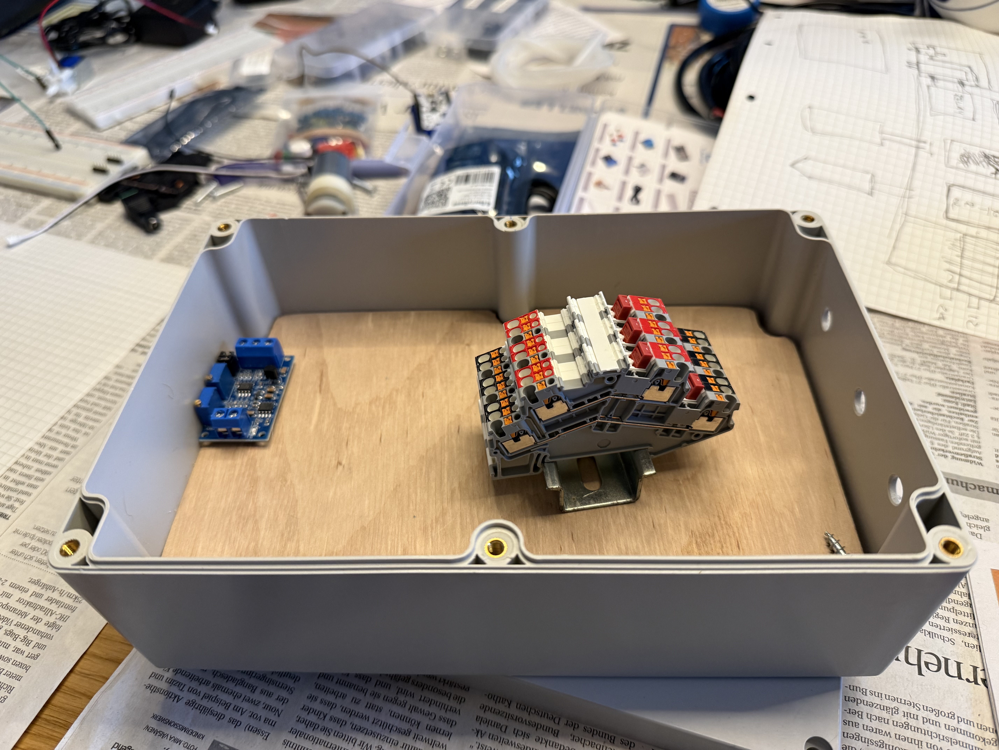
       
      <b>Mounting terminal blocks</b>
    </td>
    <td>
      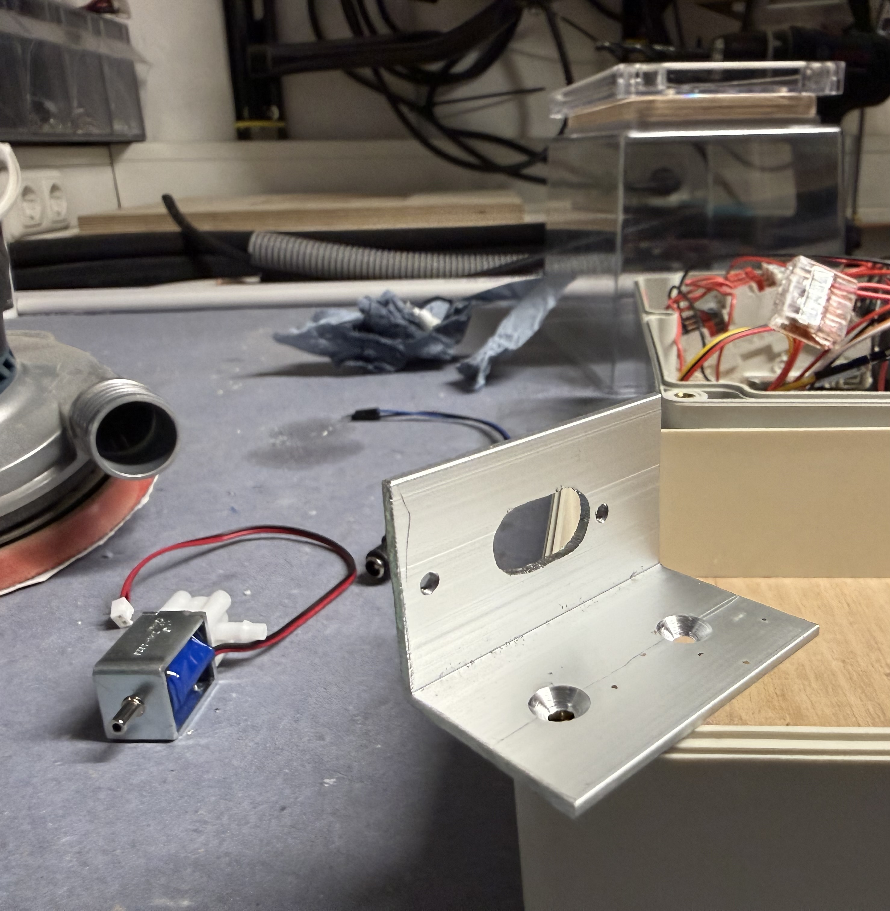
       
      <b>Aluminum mounting plate</b>
    </td>
  </tr>
  <tr>
    <td>
      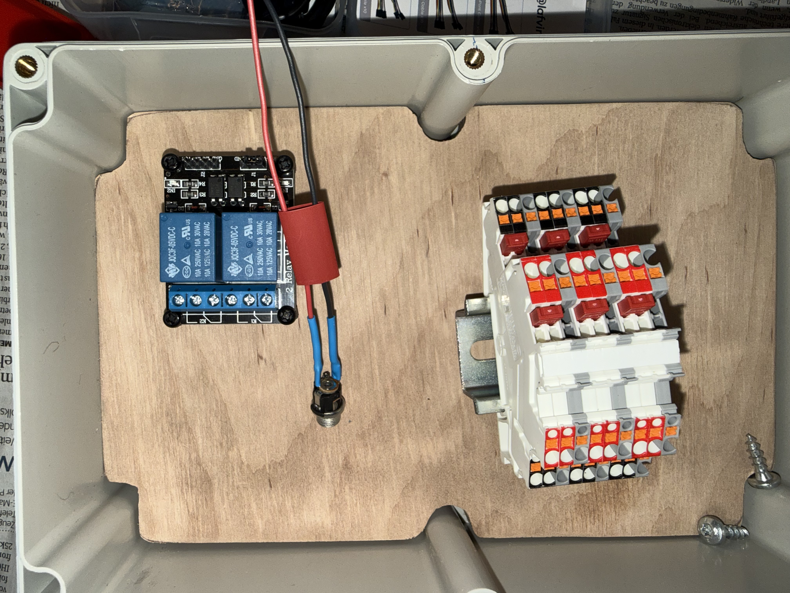
       
      <b>Soldering of connections</b>
    </td>
    <td>
      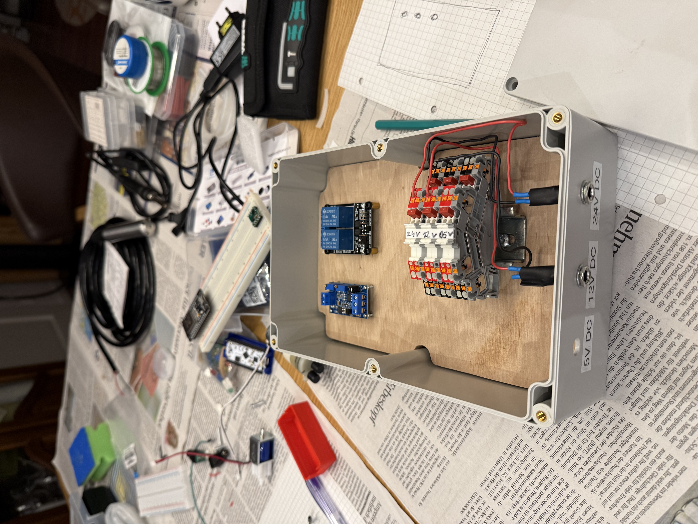
       
      <b>Wiring terminal blocks</b>
    </td>
  </tr>
  <tr>
    <td>
      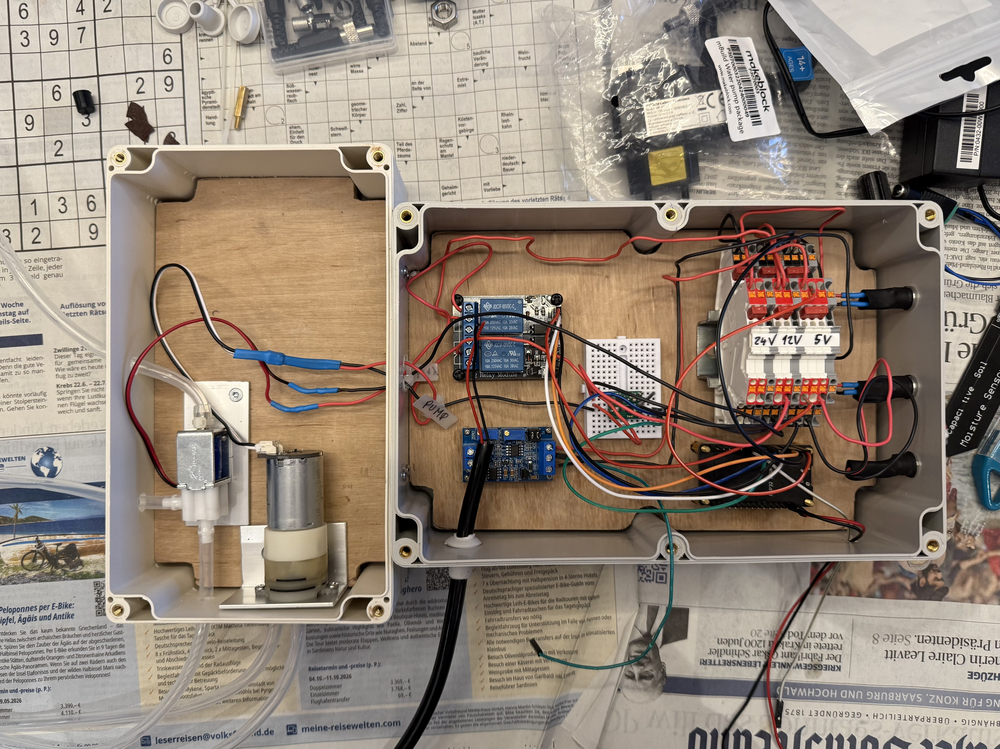
       
      <b>Electrical wiring</b>
    </td>
    <td>
      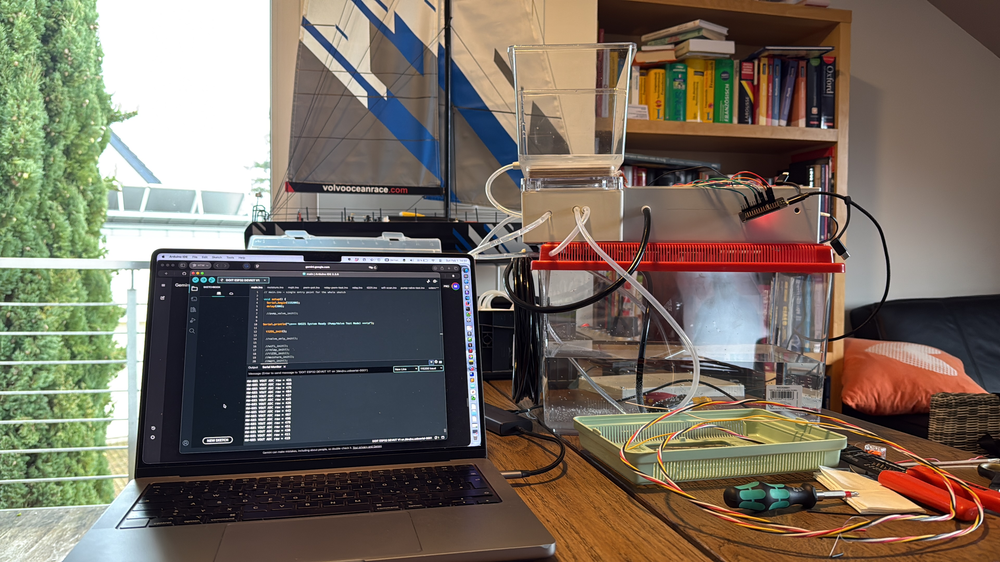
       
      <b>Finished project</b>
    </td>
  </tr>
</table>

## Quotes / Citations

- **Turais Tech Docs**, *Turais TL231 technical documentation*.
  Available at:
  <https://docs.turais.de/docs/sensors/misc/tl231-water-level-sensor/>  
  (Accessed: 2026-02-18).

- **Turais Tech Docs**, *Turais HW-685 technical documentation*.
  Available at: <https://docs.turais.de/de/docs/modules/hw685/>  
  (Accessed: 2026-02-18).

- **Polulu Docs**, *Polulu MAX14870 technical documentation*. Available
  at: <https://www.pololu.com/product/2961>  
  (Accessed: 2026-02-18).

- **Circuit State Docs**, *Curcuit State ESP32 technical documentation*.
  Available at:
  <https://www.circuitstate.com/pinouts/doit-esp32-devkit-v1-wifi-development-board-pinout-diagram-and-reference/>  
  (Accessed: 2026-02-18).

- **How to Mechatronics:** *YouTube tutorial on Controlling a DC Motor
  using an H-Bridge*. Available at:
  <https://www.youtube.com/watch?v=I7IFsQ4tQU8>  
  (Accessed: 2026-02-18).

## AI Tools

During the development of this project, Generative AI Tools like ChatGPT
and Gemini were used as supportive resources. They were primarily used
for debugging, optimizing syntax and clarifying technical concepts.
